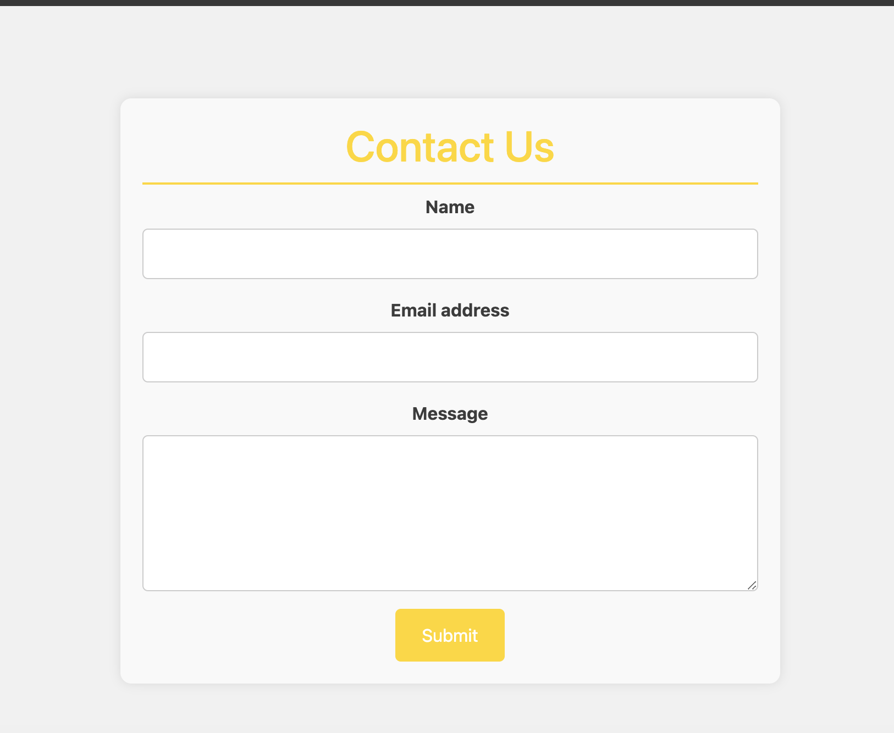

# Travel Friend

A real-time app built with FourSquare API and React.

## Description

The "Travel Friend" app provides real-time updates and notifications to keep users informed about relevant events, promotions, or changes in their travel plans. This ensures that users stay connected and informed throughout their travel experience.
Whether users are seeking adventure, relaxation, or cultural immersion, "Travel-Friend" serves as a reliable and indispensable companion for their journey.


## Table of Contents

- [Installation](#1-installation)
- [Usage](#2-usage)
- [Features](#3-features)
- [License](#4-license)
- [Contributions](#5-contributions)
- [Authors](#6-authors)


## 1. Installation

- npm create vite@latest travel-friend -- --template react
- npm install
- npm run dev
- npm i react-router-dom
- npm i react-typed
- npm i axios
- npm i bootstrap
- npm i react-google-maps/api
- npm i google-map-react
- npm i framer-motion
- git init
- git add -A
- git commit -m "initial commit"
- git remote add origin <github remote repo>
- git push origin main


## 2. Usage

- Deployed Link: https://main--travel-friend-react.netlify.app/





## 3. Features

- Navbar
- Search input
- Search button
- Animated text with React-Typed
- Hero images
- Cards that display: image, name and address of hotel and restaurant
- Animated hover effect on cards using Framer-Motion
- Contact form
- 'About' information


## 4. License


This project is licensed under the MIT License


## 5. Contributions

If you would like to contribute

1. **Fork the Repository:**
- Fork this repository to your GitHub account.
2. **Clone the Repository:**
- Clone the forked repository to your local machine:
```bash
git clone https://github.com/Ben-Rumbold/travel-friend.git
```
3. **Create a Branch:**

- Create a new branch for your contribution:
```bash
git checkout -b feature/your-feature
```
4. **Make Changes:**

- Make your changes to the codebase.

5. **Test Your Changes:**

- Test your changes locally to ensure they work as expected.
6. **Commit Your Changes:**

- Commit your changes with a descriptive commit message:
```bash
git commit -m "Add your descriptive message here"
```
7. **Push to Your Fork:**

- Push your changes to your GitHub fork:
```bash
git push origin feature/your-feature
```
8. **Open a Pull Request:**

- Open a pull request on the main repository. Provide a clear and detailed description of your changes.


## 6. Authors

- Hannah (https://github.com/HannahLas)
- Ben (https://github.com/Ben-Rumbold)
- Shane (https://github.com/shanemowatt)
- Vilma (https://github.com/vilmaglynn)
- Md (https://github.com/prodeveloper2023)
- Shkendi (https://github.com/shkendi)

